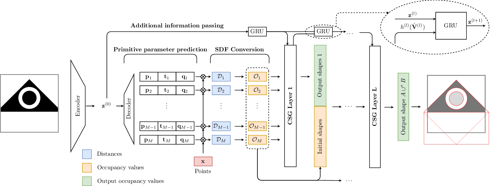
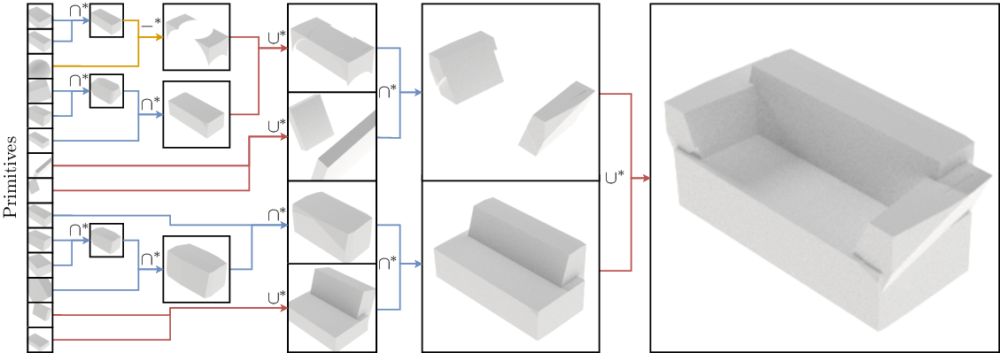

# UCSG-Net - Unsupervised Discovering of Constructive Solid Geometry Tree
### [Project Page](https://ucsgnet.github.io)| [Paper](https://arxiv.org/abs/2006.09102v3) | [Pretrained models](https://drive.google.com/file/d/1aoeEALT9ejm_G6hSw2AjtvGdbvbGGLaa/) | [CAD Dataset](https://www.dropbox.com/s/d6vm7diqfp65kyi/cad.h5?dl=0) | [ShapeNet Dataset](https://drive.google.com/file/d/158so7dnkQQNFSQTj741S3SUbuIXXRrLn/) | [ShapeNet Ground Truth](https://drive.google.com/open?id=16yiTtOrf6m4q9h3ZfhsG07JcAhLvZ0yk) | [Mitsuba Renderer](https://github.com/kacperkan/mitsuba-flask-service)

[Kacper Kania](https://kania.ml), [Maciej Zięba](https://scholar.google.com/citations?user=XmOBJZYAAAAJ&hl=en"), [Tomasz Kajdanowicz](https://scholar.google.com/citations?user=GOoaHHEAAAAJ&hl=en)
Wrocław University of Science and Technology

This is the official implementation of the paper "UCSG-Net - Unsupervised Discovering of Constructive Solid Geometry Tree".





## Installing dependencies

```bash
$ conda env create -f env.yml
$ conda activate ucsg
```

You can also run parts of experiments in the Docker, however note, that visualizations
are performed in yet another container. Hence, only evaluation itself, without
visualizations can be performed in the Docker. Run:
```bash
$ docker build -t ucsgnet:1.0 [-f Dockerfile.gpu] .
$ docker run [--gpus all] --rm -it -v $(pwd):/usr/src/ucsgnet --name ucsgnet ucsgnet:1.0 
```
to enter the container. All changes in the docker will be reflected in your directory.

You can also create whole ecosystem with the rendering in docker by running:
```bash
$ docker network create --driver bridge ucsgnet
$ git submodule update --init --recursive
$ cd mitsuba-flask-service/ &&  docker build -t mitsuba . 
$ docker run -it -p 8000:8000 --name mitsuba --network ucsgnet mitsuba:latest 
# or `$ docker start mitsuba --attach` if you built it previously
# get to the other terminal
$ docker build -t ucsgnet:1.0 [-f Dockerfile.gpu] . 
$ docker run [--gpus all] --network ucsgnet --rm -it -v $(pwd):/usr/src/ucsgnet --name ucsgnet ucsgnet:1.0 
```

## Pretrained models
Download from [here](https://drive.google.com/file/d/1aoeEALT9ejm_G6hSw2AjtvGdbvbGGLaa/) and place them in `models` folder, so the structure is similar to `<project-folder>/models/3d_64` and `<project-folder>/models/cad_main`. Note that running `dvc repro` will remove these models (since they're going to be from the beginning). Check `dvc pipeline show --ascii` output to see which stages of the pipeline are going to remove the models (pipelines with `run_experiment.dvc` in their names retrain the model from the beginning).

## Dataset requirements
Due to license restrictions and memory limitations, we are not able to attach
datasets directly to the repo. We described below, how to organize datasets
so the experiments can be run smoothly.

### CAD Dataset
CAD dataset can be downloaded from 
[here (62.5 MB)](https://www.dropbox.com/s/d6vm7diqfp65kyi/cad.h5?dl=0). Then:
```bash
$ mkdir data/cad
$ mv cad.h5 data/cad
```

### ShapeNet Dataset
The ShapeNet including sampling was already preprocessed by [Zhiqin et al.](https://github.com/czq142857/IM-NET).
We provide their downloadable [link](https://drive.google.com/file/d/158so7dnkQQNFSQTj741S3SUbuIXXRrLn/) 
that includes all the data necessary to run experiments. 
Check [this link](https://github.com/czq142857/IM-NET/tree/master/point_sampling)
to find out more about preprocessing steps.
After downloading and unzipping the dataset, move files to appropriate directories:
```bash
$ mkdir data/hdf5
$ mv IM-NET/IMSVR/data/*.hdf5 IM-NET/IMSVR/data/*.txt data/hdf5/
```

Additionally, ground truth in the form of points with normals is needed. You can
download it from [here](https://drive.google.com/open?id=16yiTtOrf6m4q9h3ZfhsG07JcAhLvZ0yk).
Then, you can unzip it directly to necessary folder:
```bash
$ mkdir data/pointcloud_surface
$ unzip pointcloud_surface.zip -d data/pointcloud_surface
```

To visualize the ground truth ShapeNet dataset, needed for visualization, you 
need download official ShapeNetV2 repository from [here](https://www.shapenet.org/)
(requires registration). After that, you need put all files into `data/shapenet`
so the `taxonomy.json` file, located in the original dataset, is located at
`data/shapenet/taxonomy.json`.

```bash
$ mkdir data/shapenet
$ mv <path-to-shapenet-folders> data/shapenet/
$ cat data/shapenet/taxonomy.json
```

## Additional dependencies
For the visualization, we used [Mitsuba renderer](https://www.mitsuba-renderer.org/index_old.html). [Here](https://github.com/kacperkan/mitsuba-flask-service), you can find a Flask service that runs mitsuba in the background at gives an API to render objects.

## Running experiments
All experiments are defined in a Dvcfile (from the `dvc` dependency included
in the `env.yml` file). To visualize the pipeline, use:

```bash
$ dvc pipeline show --ascii Dvcfile
```
From there, you can notice, which experiment/visualization to run using which
file with the command:
```bash
$ dvc repro dvc/<folder>/<experiment_name>.dvc
```

You can also run experiments manully, one by one, as described below.

Note that running any experiment as a `dvc` file will remove any dependencies
that were produced by that file. In case of models, it will remove pretrained models.
Please, read below how to avoid such a situation.
### CAD Dataset experiment
```bash
$ dvc repro [-s] dvc/cad_experiment/evaluate_model.dvc
```
It will output models in `models/cad_main` and metrics in 
`paper-stuff/metrics/cad_experiment`. To obtain visualizations, run:

```bash
$ dvc repro [-s] dvc/paper/visualize_2d_predicted_shapes_cad.dvc
```
This will produce all visualizations in `paper-stuff/2d-shapes-visualization/cad`.

### 3D ShapeNet experiment
As it is the most demanding task, the experiment takes about 2 days to run
on the Nvidia TITAN RTX GPU. To evaluate metrics, run:

```bash
$ dvc repro dvc/3d_experiment/evaluate_model.dvc
```
or 
```bash
$ dvc repro -s dvc/3d_experiment/reconstruct_3d_shapes.dvc
$ dvc repro -s dvc/3d_experiment/generate_edge_data.dvc
$ dvc repro -s dvc/3d_experiment/evaluate_model.dvc
```
to avoid retraining model and removal of attached weights.


It will output models in `models/3d_64` and metrics in 
`paper-stuff/metrics/3d_experiment`.

For visualizations, run:
```bash
$ dvc repro [-s] dvc/3d_experiment/visualize_reconstructions.dvc
```
which will output renders to the `data/3d_renders` directory.

### Other visualizations
All other visualizations, that were used in the paper, can be reproduced by
following the command schema:
```bash
$ dvc repro dvc/paper/example_csg_on_binary_sets.dvc
$ dvc repro dvc/paper/prediction_layer_example.dvc
```
Files `visualize_2d_predicted_shapes_cad.dvc` require pretrained cad models.
Visualizations of CSG trees were performed manually by using `3d_renders/.../csg_path`
output folder from the experiments. The same applies for the CAD experiment.

*If any script crashes due to lack of appropriate folders, follow the 
instructions provided in the output of the command.

## Training visualization
All models and logs are saved to `models/` directory. To visualize learning, 
you have to run:
```bash
tensorboard --logdir models/
```

Some tensorboard files are already provided.
